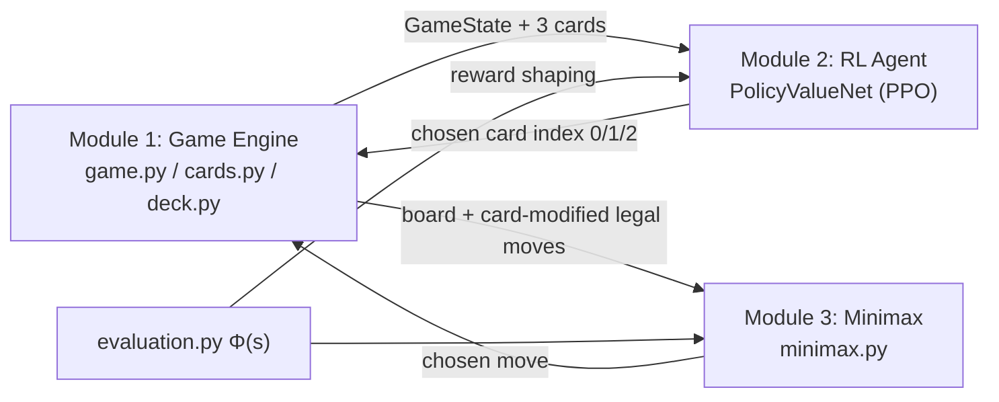

# Card-Chess RL — Mid-Review Prep Guide

> [!IMPORTANT]
> Every number in this guide comes from the **actual code**, checked on 9 Oct 2026. I also ran the training loop once (1 iteration, 2 games) to confirm it works end to end. It does, at about **2 seconds per game**.

---

## 0. The 30-second pitch (memorise this)

> "We built a chess variant. Every round, a coin toss picks one player, three rule-changing cards are drawn from a 15-card deck, and that player picks one. The card's rule applies to **both** players for that round. Our RL agent learns **which card to pick**. The chess moves themselves are played by a classical alpha-beta minimax engine. We frame card selection as a **Semi-MDP**, because the agent only gets a decision when it wins the toss, so the time between its decisions varies. We train it with **PPO** (actor-critic) and use **potential-based reward shaping**, where the shaping term is discounted by γ^Δt to handle those variable gaps. The engine, cards, search, RL environment, network, PPO trainer, baselines and a browser GUI are all implemented and tested (20/20 tests pass). What's left is the full-scale training run and the experiments."

---

## 1. Progress: done vs. left

### ✅ Done
| Area | What exists |
|---|---|
| Submissions | Goals 1–8 (PDF), Goals 9–14 (`CardChessRL_Goals9_14.docx`) |
| Module 1: Game engine | Board wrapper, 15 cards, deck, round controller, game state |
| Module 3: Search | Evaluation function Φ(s), alpha-beta minimax with move ordering |
| Module 2: RL | State encoding, policy/value network, Gym-style env with reward shaping, PPO trainer, checkpointing, JSON logging |
| Experiments | Baselines (random, always-first, greedy, trained) and a match/experiment runner |
| GUI | Flask + chessboard.js. Drag and drop, card picking, only card-legal moves allowed |
| Tests | 20 pytest tests across 4 test files, all passing |
| Repo | Pushed to GitHub (`Averon-Resol/card-chess-rl`) |

### ⬜ Left
1. **A real training run.** No trained model exists yet. Only a 1-iteration smoke test has been run.
2. **Experiment results.** Win rates of RL vs random / always-first / greedy. The runner exists, but no results have been produced.
3. **Plug the trained model into the GUI.** Right now the GUI agent picks cards **randomly** (see §7).
4. **True self-play.** Currently the opponent in training picks cards randomly (see §7).
5. **Ablations from Goal 12.** Shaping vs. no shaping, and γ^Δt vs. fixed γ.
6. **Stockfish benchmarking.** Optional and low priority.

**If asked "what % is done?"** A fair answer: *"All the infrastructure is built, roughly 75–80% of the engineering. The remaining part is the compute-heavy training and the experimental evaluation."*

---

## 2. System architecture

**Key design point:** the RL agent does **not** play chess moves. It only picks cards (action space = 3). Moves come from minimax. The same evaluation function Φ is used both as minimax's leaf evaluator and as the RL shaping potential.

---

## 3. File-by-file map (what code does what)

### Module 1: `cardchess_rl/engine/`
| File | Key contents |
|---|---|
| [cards.py](file:///c:/Users/ihsal/Desktop/A%20University%20Life/Sem%207/Reinforcement%20Learning/cardchess_rl/engine/cards.py) | `Card` abstract base class with `modify_legal_moves(board, color) -> set[Move]`. 15 subclasses. `ALL_CARDS` list. `_is_safe_move()` checks a non-standard move doesn't leave the king in check. Move helpers (`_get_knight_moves`, `_get_bishop_moves`, …). `get_card_feature_vector(card)` returns a 24-dim vector. |
| [deck.py](file:///c:/Users/ihsal/Desktop/A%20University%20Life/Sem%207/Reinforcement%20Learning/cardchess_rl/engine/deck.py) | `Deck` class: `draw(3)`, `discard(card)`, `return_cards(cards)`, `reshuffle()`, `get_deck_state()` (15 bools), `remaining` |
| [state.py](file:///c:/Users/ihsal/Desktop/A%20University%20Life/Sem%207/Reinforcement%20Learning/cardchess_rl/engine/state.py) | `GameState` dataclass: board, active_card, round_number, picker, candidate_cards, deck_state, is_terminal, result |
| [game.py](file:///c:/Users/ihsal/Desktop/A%20University%20Life/Sem%207/Reinforcement%20Learning/cardchess_rl/engine/game.py) | `CardChessGame`: `start_round()` (coin toss + draw 3), `pick_card()`, `get_legal_moves(color)` (card-modified), `make_move()`, `end_round()`, `get_state()`, `play_round(picker_fn, white_fn, black_fn)` |

### Module 3: `cardchess_rl/search/`
| File | Key contents |
|---|---|
| [evaluation.py](file:///c:/Users/ihsal/Desktop/A%20University%20Life/Sem%207/Reinforcement%20Learning/cardchess_rl/search/evaluation.py) | `evaluate(board)` (White's perspective), `evaluate_for_side(board, color)`, `evaluate_material_only(board)`. Piece-square tables. |
| [minimax.py](file:///c:/Users/ihsal/Desktop/A%20University%20Life/Sem%207/Reinforcement%20Learning/cardchess_rl/search/minimax.py) | `minimax_search(board, depth, legal_moves, maximizing, alpha, beta)`, `order_moves()` (captures +10, checks +5), `choose_move()`, `choose_move_random()` |

### Module 2: `cardchess_rl/agent/`
| File | Key contents |
|---|---|
| [encoding.py](file:///c:/Users/ihsal/Desktop/A%20University%20Life/Sem%207/Reinforcement%20Learning/cardchess_rl/agent/encoding.py) | `encode_board()` → 16×8×8, `encode_cards()` → 72, `encode_deck()` → 15, `encode_state()` → dict of tensors |
| [network.py](file:///c:/Users/ihsal/Desktop/A%20University%20Life/Sem%207/Reinforcement%20Learning/cardchess_rl/agent/network.py) | `PolicyValueNet`: conv trunk, shared FC, policy head, value head |
| [env.py](file:///c:/Users/ihsal/Desktop/A%20University%20Life/Sem%207/Reinforcement%20Learning/cardchess_rl/agent/env.py) | `CardChessEnv`: `reset()`, `step(action)`, `_advance_to_agent_pick()`, `_play_move_pair()`, `_compute_shaping_reward()`, `_get_phi()` |
| [training.py](file:///c:/Users/ihsal/Desktop/A%20University%20Life/Sem%207/Reinforcement%20Learning/cardchess_rl/agent/training.py) | `PPOTrainer`: `collect_games()`, `compute_returns_and_advantages()` (GAE), `ppo_update()`, `train()`, `evaluate_vs_random()`, `save_checkpoint()` / `load_checkpoint()` |
| [train.py](file:///c:/Users/ihsal/Desktop/A%20University%20Life/Sem%207/Reinforcement%20Learning/cardchess_rl/train.py) | Entry point: 32 games/iter, 50 iterations, eval every 10 |

### Experiments, GUI, tests
| File | Key contents |
|---|---|
| [baselines.py](file:///c:/Users/ihsal/Desktop/A%20University%20Life/Sem%207/Reinforcement%20Learning/cardchess_rl/experiments/baselines.py) | `random_picker`, `always_first_picker`, `greedy_picker` (1-ply lookahead per card), `trained_picker(net)` (argmax) |
| [runner.py](file:///c:/Users/ihsal/Desktop/A%20University%20Life/Sem%207/Reinforcement%20Learning/cardchess_rl/experiments/runner.py) | `play_match()` (cap: 200 rounds), `run_experiment()` (alternates colours), `run_all_experiments()` (7 matchups, saves JSON) |
| [gui/app.py](file:///c:/Users/ihsal/Desktop/A%20University%20Life/Sem%207/Reinforcement%20Learning/cardchess_rl/gui/app.py) | Flask server. Endpoints `/api/state`, `/api/pick_card`, `/api/move`, `/api/reset`. Agent moves with minimax depth 3. |
| `tests/` | `test_engine.py` (3), `test_evaluation.py` (6), `test_minimax.py` (6), `test_agent.py` (5) = **20 tests** |

---

## 4. RL formulation

### 4.1 Why it's a Semi-MDP (not a plain MDP)
The agent only acts when it **wins the coin toss** (probability 0.5 each round). Between two agent decisions, a random number of rounds Δt pass, on average 2 (geometric distribution). During those rounds the opponent picks cards and both sides move. Because decisions happen at irregular intervals, this is a **Semi-Markov Decision Process**, and discounting should use γ^Δt.

### 4.2 Components
| Element | Definition in our code |
|---|---|
| **State s** | Board: 16×8×8 planes (12 piece planes, side-to-move, White castling, Black castling, en passant). Cards: 3 × 24 = 72 floats. Deck: 15 bits (which cards are still in the draw pile). |
| **Action a** | Index ∈ {0, 1, 2}: which of the 3 drawn cards to pick |
| **Transition** | Stochastic: coin tosses, random deck draws, the opponent's card choice, minimax moves under the card |
| **Reward** | Terminal (+1 win / 0 draw / −1 loss, from the agent's side) **+** shaping F |
| **Shaping** | F = γ^Δt · Φ(s′) − Φ(s), with Φ(s) = `evaluate_for_side(board, agent)/1000` and Φ(terminal) = 0 |
| **Policy** | π_θ(a\|s) = softmax(policy logits). Stochastic. Sampled during training, argmax at evaluation. |
| **Value** | V_φ(s) ∈ [−1, 1] (tanh head), used as the critic/baseline |
| **Objective** | PPO clipped surrogate (formula in §4.4) |

### 4.3 Card feature vector (24 dims)
- `[0:6]` target piece one-hot (pawn, knight, bishop, rook, queen, king)
- `[6:9]` effect type one-hot (add / restrict / special)
- `[9:24]` card ID one-hot (15)

### 4.4 PPO loss as implemented
$$
L = \underbrace{-\mathbb{E}\big[\min(r_t A_t,\ \text{clip}(r_t, 1-\epsilon, 1+\epsilon)A_t)\big]}_{\text{policy}} + 0.5\,\underbrace{\text{MSE}(V, R)}_{\text{value}} - 0.01\,\underbrace{H(\pi)}_{\text{entropy}}
$$
where $r_t = \exp(\log\pi_{new} - \log\pi_{old})$.

Advantages come from **GAE**: $\delta_t = r_t + \gamma V(s_{t+1}) - V(s_t)$, $A_t = \delta_t + \gamma\lambda A_{t+1}$. Returns are $R_t = A_t + V(s_t)$. Advantages are normalised (mean 0, std 1) before each update.

---

## 5. Every constant / hyperparameter

### PPO (`training.py`)
| Name | Value | Meaning |
|---|---|---|
| `lr` | **3e-4** | Adam learning rate |
| `gamma` | **0.99** | Discount factor |
| `gae_lambda` | **0.95** | GAE λ (bias–variance trade-off) |
| `clip_eps` | **0.2** | PPO clipping ε. The ratio is kept within [0.8, 1.2]. |
| `value_coeff` | **0.5** | Weight of the value loss |
| `entropy_coeff` | **0.01** | Entropy bonus (encourages exploration) |
| `ppo_epochs` | **4** | Passes over each batch of collected data |
| `batch_size` | **64** | Minibatch size |
| `games_per_iter` | 64 default; **32 in `train.py`** | Games collected per iteration |
| Iterations | **50** (`train.py`) | |
| Eval interval | every **10** iters, **50** games, greedy argmax vs random opponent | |
| Grad clipping | max-norm **0.5** | |
| Advantage-norm epsilon | 1e-8 | Numerical stability only |
| Optimizer | **Adam** | |
| Device | CUDA if available, else CPU (this machine: CPU, PyTorch 2.13.0+cpu) | |

### Environment (`env.py`)
| Name | Value |
|---|---|
| Agent colour | White (default) |
| Minimax depth during training | **2** (env default; see bug B4) |
| Φ scaling | eval / **1000** (centipawns → roughly pawn-thousandths) |
| Opponent card policy | uniform random |

### Evaluation function (`evaluation.py`)
| Term | Value |
|---|---|
| Pawn / Knight / Bishop / Rook / Queen / King | **100 / 320 / 330 / 500 / 900 / 0** |
| Checkmate | **±10000** |
| Stalemate / insufficient material / 75-move / fivefold | **0** |
| Bishop pair bonus | **+50** |
| Mobility | **2 per legal move**, side to move only. This is why the start position scores +40 (20 moves × 2). |
| Game phase | non-pawn material / **6400**. Blends middlegame and endgame king tables. |
| Piece-square tables | Standard "Simplified Evaluation Function" (Chess Programming Wiki), mirrored for Black via `sq ^ 56` |

### Minimax
Depth **3** in the GUI and default, **2** in the RL env, **1** in experiments. Move ordering: captures +10, checks +5. Alpha-beta pruning.

### Network (`network.py`)
| Layer | Shape |
|---|---|
| Conv1 | 16 → 32, 3×3, pad 1, ReLU |
| Conv2 | 32 → 64, 3×3, pad 1, ReLU |
| Conv3 | 64 → 64, 3×3, pad 1, ReLU |
| Flatten | 64·8·8 = **4096** |
| Concat | 4096 + 72 + 15 = **4183** |
| Shared FC | 4183 → 256, ReLU |
| Policy head | 256 → 3 (logits) |
| Value head | 256 → 1, tanh |
| **Total params** | **≈ 1.13 M** (1,132,196). ~95% of them are in the shared FC layer. |

> [!NOTE]
> The network docstring says "343 → 256". That number is wrong; the real input to the FC layer is 4183. Quote 4183 if asked.

### Deck/game rules
15 cards. Draw 3. The picked card goes to the discard pile. The 2 unpicked cards go back and the pile is reshuffled. When fewer than 3 cards remain, the discard pile is shuffled back in. One "round" = one move-pair (White then Black).

---

## 6. The 15 cards

| # | Card | Type |
|---|---|---|
| c1 | Queen gains knight moves | Add |
| c2 | Bishops gain knight moves | Add |
| c3 | Rooks can move 1 square diagonally | Add |
| c4 | King gains knight moves | Add |
| c5 | Pawn sidestep (1 square left/right) | Add |
| c6 | Knights gain bishop moves | Add |
| c7 | Bishops move 1 square orthogonally | Add |
| c8 | Frozen knights | Restrict |
| c9 | Frozen bishops | Restrict |
| c10 | Frozen rooks | Restrict |
| c11 | Frozen queen | Restrict |
| c12 | Pawns cannot capture | Restrict |
| c13 | All pieces may also move 1 square any direction | Special |
| c14 | Pawns can move 1 square backward | Special |
| c15 | Knights extended range ((3,1) jumps) | Special |

All added moves are filtered so you can never leave your own king in check.

---

## 7. Honest weaknesses / known issues

> [!WARNING]
> Know these before the examiners find them. Saying "yes, we know, here's the plan" scores much better than being caught out.

| # | Issue | What to say |
|---|---|---|
| B1 | **No trained model yet.** | "Infrastructure is complete. Full training is the next milestone." |
| B2 | **The GUI agent picks cards randomly** (`app.py` line 39 uses `random_picker`). *Correction: I previously told you it used the greedy picker. That was wrong.* | "The GUI is a rules demo. The trained policy plugs in through `trained_picker(net)` once training finishes." |
| B3 | **Not true self-play yet.** The opponent picks cards uniformly at random, and `collect_games` always plays the agent as White (the docstring says half and half). | "Phase 1 trains against a random-card opponent as a curriculum. Phase 2 switches to current-weights self-play as planned in Goal 11." |
| B4 | `collect_games` creates `CardChessEnv()` without passing `move_depth`, so the `move_depth=1` in `train.py` is ignored and depth 2 is used. | One-line fix. |
| B5 | GAE uses a fixed γ per decision, not γ^Δt. The SMDP discounting is only applied inside the shaping term. | "The shaping term is SMDP-correct. Extending γ^Δt to GAE is planned, and it's one of our ablations." |
| B6 | `evaluate_vs_random` counts a win as `reward > 0` on the last step. That reward includes shaping, so a draw with positive shaping could be counted as a win. | Fix: use `info['terminal_reward'] > 0`. |
| B7 | Minimax applies the card only at the root ply. Deeper plies assume standard chess rules, even though the opponent's reply in the same round is also card-modified. | "It's a deliberate approximation for speed. A card-aware search over the full round is future work." |
| B8 | Castling planes: the kingside and queenside halves are swapped (kingside sets files a–d). | Harmless. The encoding is consistent, so the network just learns it. |
| B9 | If a restriction card leaves a side with zero legal moves, that side simply skips its move. This edge case is untested. | Mention only if asked. |

---

## 8. Question bank (with model answers)

### A. Formulation
**Q: What is your state, action, reward?**
See §4.2. State = board planes + 3 card features + deck bits. Action = pick card 0, 1 or 2. Reward = terminal ±1/0 plus potential-based shaping.

**Q: Why is it a Semi-MDP?**
The agent only acts when it wins the coin toss, so the number of rounds between its decisions (Δt) is random. The discount between decisions should be γ^Δt, not γ.

**Q: Is the environment stochastic or deterministic?**
Stochastic. Coin toss, card draws and the opponent's card choice are all random. Minimax itself is deterministic given the board and the card.

**Q: Is it fully observable?**
Yes for the board and the 3 candidate cards. The deck state is included, so the agent knows what can still be drawn. The future draw order is hidden. That is stochasticity, not partial observability of the current state.

**Q: Episodic or continuing?**
Episodic. Each episode is one game, ending in checkmate, stalemate or a draw rule (the runner caps games at 200 rounds).

**Q: How big is the state space?**
Chess alone has roughly 10^43–10^47 legal positions. Multiply by C(15,3) = 455 card combinations and 2^15 deck states. That rules out tabular methods.

**Q: Single-agent or multi-agent?**
It's a two-player zero-sum game. We treat it as single-agent RL against a fixed opponent policy (random card picker + minimax). Self-play turns it into a multi-agent setting.

### B. Algorithm choice
**Q: Why not Q-learning?**
1. **Tabular Q-learning is impossible.** The state space is astronomically large (see above).
2. **DQN (deep Q-learning) is possible** since the action space is tiny (3). But:
   - **Self-play is non-stationary.** The opponent changes as the agent learns. DQN's experience replay stores transitions generated against old opponents, so its training data goes stale. PPO is on-policy and only uses fresh data.
   - **Stochastic policies matter in games.** Q-learning gives a deterministic greedy policy, which an opponent can exploit. PPO learns a probability distribution over cards, so it can learn mixed strategies.
   - **Stability.** PPO's clipped objective limits how far each update moves the policy. DQN can be unstable (the "deadly triad": function approximation + bootstrapping + off-policy learning).
   - **Variance reduction for free.** The actor-critic value head gives a baseline that reduces variance, which matters with sparse ±1 rewards.
   - **Precedent.** AlphaZero (policy + value net) and OpenAI Five (PPO) both use policy-gradient-family methods for games.
3. Honest caveat: *"DQN would be a reasonable alternative given 3 actions. Comparing against it is a possible extension."*

**Q: Why not REINFORCE / vanilla policy gradient?**
High variance and no protection against overly large updates. PPO adds a critic baseline (lower variance) and clipping (stable updates).

**Q: Why not A2C/A3C or TRPO?**
TRPO enforces a hard KL constraint, which is more complex (second-order optimisation). PPO approximates it with a simple clip. A2C has no protection against large updates. PPO is the practical default.

**Q: Why not MCTS / AlphaZero?**
MCTS would need a model of the card-chess dynamics, plus a huge amount of compute. Our action space (which card) is tiny, while the board dynamics are very expensive to simulate. We use search where it's cheap and effective (moves) and RL where the decision is strategic (cards).

**Q: On-policy or off-policy?**
On-policy. Data is collected with the current policy, used for 4 epochs, then thrown away. The importance ratio plus clipping allows those few reuse epochs.

**Q: Model-free or model-based?**
Model-free for the card agent. Minimax is model-based, but it isn't the learner.

**Q: Value-based, policy-based, or actor-critic?**
Actor-critic. The policy head is the actor, the value head is the critic.

### C. "Where's epsilon?" / exploration
**Q: What is your epsilon? Do you use epsilon-greedy?**
**No epsilon-greedy.** The only ε in the code is **PPO's clip ε = 0.2**, which limits how far the policy can change per update (ratio kept within [0.8, 1.2]). It is not an exploration rate.

**Q: Then how does the agent explore?**
1. Actions are **sampled** from the softmax distribution during training (`Categorical(logits).sample()`), so every card keeps a non-zero probability.
2. An **entropy bonus (coefficient 0.01)** in the loss penalises the policy for becoming too confident too early.
3. The environment's own randomness (tosses, draws) adds variety.
At evaluation time we use **argmax**, so play is fully greedy.

**Q: What happens if entropy_coeff is too high or too low?**
Too high: the policy stays near-uniform and never commits. Too low: it collapses early onto one card and stops exploring.

### D. Reward shaping
**Q: Why reward shaping?**
The real reward (win/loss) only arrives at the end of a game, which can take 100+ moves. That's a sparse reward and a hard credit-assignment problem. Shaping gives intermediate signal based on how the position evaluation changes.

**Q: Doesn't shaping change the optimal policy?**
Not if it's **potential-based** (Ng, Harada & Russell, 1999): F = γΦ(s′) − Φ(s). The shaping terms telescope over an episode, so the optimal policy is unchanged. We need Φ(terminal) = 0, which the code does.

**Q: What's novel about yours?**
We use **γ^Δt** instead of γ, because decisions happen at variable intervals in the Semi-MDP. This extends Ng's invariance result to the SMDP setting.

**Q: What's Φ?**
The minimax evaluation (material + piece-square tables + bishop pair + mobility + king phase blend), from the agent's perspective, divided by 1000.

**Q: Why divide by 1000?**
To keep shaping rewards on roughly the same scale as the ±1 terminal reward. A pawn is about 0.1.

### E. Network & training mechanics
**Q: Why a CNN?**
Board positions have spatial structure (piece adjacency, lines, attacks). Convolutions share weights across squares and capture local patterns, the same reason AlphaZero uses them.

**Q: Why two heads?**
The policy head picks cards (actor). The value head estimates expected return (critic), which is used to compute advantages. Sharing a trunk lets both learn common features.

**Q: Why tanh on the value head?**
Game outcomes lie in [−1, 1].

**Q: What is GAE and why λ = 0.95?**
GAE is an exponentially weighted average of multi-step TD errors. λ = 0 is one-step TD (low variance, high bias). λ = 1 is Monte Carlo (high variance, low bias). 0.95 is the standard compromise.

**Q: Why γ = 0.99?**
Games are long and only the final outcome truly matters, so we want a long horizon. 0.99 gives an effective horizon of about 100 decisions.

**Q: Why normalise advantages?**
It keeps the gradient scale stable across batches, regardless of the reward magnitude.

**Q: Why gradient clipping at 0.5?**
It prevents exploding gradients from destabilising training. 0.5 is the standard PPO value.

**Q: How many parameters?**
About 1.13 M.

**Q: How long will training take?**
Measured at about 2 s per game on CPU at minimax depth 2. With 32 games per iteration, that's about 1 minute per iteration, so 50 iterations is about 1 hour. The Goal 11 target of 50k+ games would be about 28 hours on CPU, or less at depth 1 or on a GPU.

### F. Evaluation
**Q: How will you evaluate the agent?**
Win rate vs three baselines (random, always-first, greedy one-ply), with colours alternated. Secondary metrics come from Goal 12 (game length, card-choice distribution, and so on). Ablations: with/without shaping, and γ^Δt vs fixed γ.

**Q: What's the greedy baseline exactly?**
For each candidate card, try every card-legal move one ply deep. Pick the card whose best resulting position evaluates highest for the picker.

**Q: What win rate is "good"?**
Random vs random should be about 50% (our calibration check). The RL agent should beat random clearly and beat greedy, since greedy ignores the opponent's reply and the longer-term effects.

**Q: How do you know the engine is correct?**
20 unit tests. Every card's moves are checked to never leave the king in check. Deck draw/discard/reshuffle invariants are tested. Full random games terminate. The evaluation finds mate/stalemate correctly. Minimax finds mate-in-1 and avoids hanging the queen.

### G. Design / game rules
**Q: Why does the card apply to both players?**
It makes the choice strategic. You must pick a card that helps you more than it helps your opponent, given the current position.

**Q: Why does the RL agent only pick cards and not moves?**
Chess-move RL needs AlphaZero-scale compute. Isolating the novel decision (cards) makes the RL problem tractable and lets us measure what the agent learned.

**Q: Why python-chess?**
It's a mature, fast library for move generation and legality checks. We wrap its legal-move generator, and cards add or remove moves.

---

## 9. Suggested demo flow (5 minutes)
1. Run `python cardchess_rl/gui/app.py` and open `http://127.0.0.1:5000`.
2. Win a toss and show the 3 cards. Pick one like *Pawn sidestep*, then show that sideways pawn moves are now legal.
3. Show a restriction card (*Frozen knights*). Knights can't be dragged.
4. Run `python -m pytest cardchess_rl/tests/ -v` and show 20 passed.
5. Show `training.py` and walk through the PPO loss (lines 174–181).
6. Show `env.py` `_compute_shaping_reward` (γ^Δt shaping).
